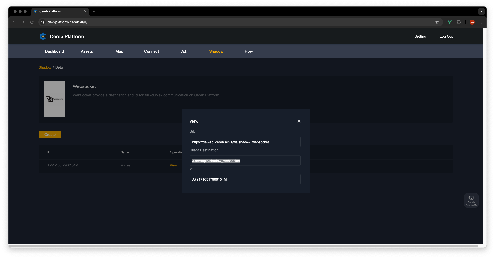
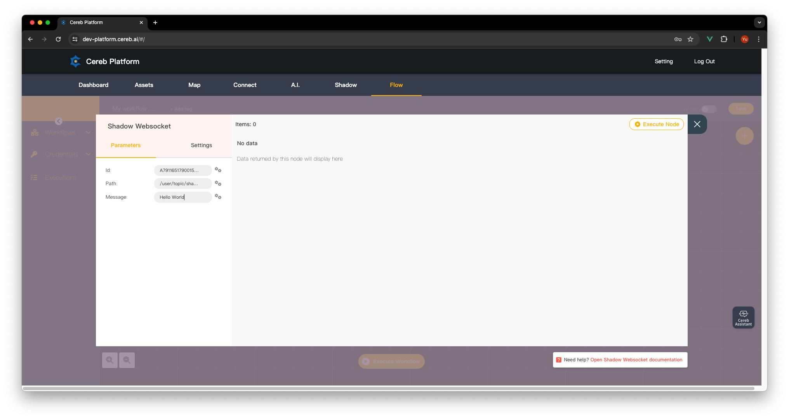

# frontend-websocket-shadow-sdk

# 使用方法

pubspec.yaml

git

```yaml
dependencies:
  frontend_websocket_shadow_sdk:
    git:
      url: git://github.com/cereb-ai/frontend-websocket-shadow-sdk.git
      ref: main
```

本地

```yaml
dependencies:
  frontend_websocket_shadow_sdk:
    path: /path/to/frontend-websocket-shadow-sdk
```

客户端

```dart
final client = CerebWebsocketShadowSdk(
  url: "https://dev-api.cereb.ai/v1/ws/shadow_websocket",
  path: "/user/topic/shadow_websocket",
  id: "A791716517900154M",
);
client.connect();
client.subscribe(
  '/user/topic/shadow_websocket',
  (StompFrame frame) {
    log(frame.body ?? 'null');
  },
);
client.send('test');
client.unsubscribe('/user/topic/shadow_websocket');
client.disconnect();
```

服务器配置


发送消息


# 单元测试

```shell
flutter test
```

# 参考项目

frontend-iotena-app

# 发布项目

[github action](https://dart.dev/tools/pub/automated-publishing)
